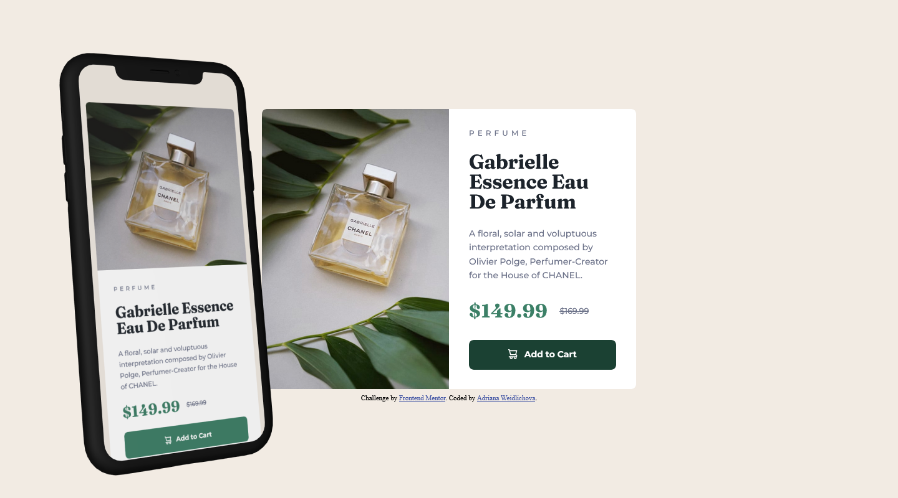

# Frontend Mentor - Product preview card component solution

This is a solution to the [Product preview card component challenge on Frontend Mentor](https://www.frontendmentor.io/challenges/product-preview-card-component-GO7UmttRfa).  

## Table of contents

- [Frontend Mentor - Product preview card component solution](#frontend-mentor---product-preview-card-component-solution)
  - [Table of contents](#table-of-contents)
  - [Overview](#overview)
    - [The challenge](#the-challenge)
    - [Screenshot](#screenshot)
    - [Links](#links)
  - [My process](#my-process)
    - [Built with](#built-with)
    - [What I learned](#what-i-learned)
    - [Continued development](#continued-development)
    - [Useful resources](#useful-resources)
    - [AI Collaboration](#ai-collaboration)
  - [Author](#author)
  - [Acknowledgments](#acknowledgments)

## Overview

### The challenge

This project is part of my portfolio for PrestaShop template development. The goal was to create a fully responsive product card component with an emphasis on clean code and modern CSS methods.

### Screenshot



### Links

- Solution URL: [Github Repository](https://github.com/Saliva-sys/Product-preview-card.git)
- Live Site URL: [Live Site](https://saliva-sys.github.io/Product-preview-card/)

## My process

### Built with

- Semantic HTML5 markup
- CSS custom properties (Variables) - Colors and fonts are managed via CSS variables (:root), making it easier to edit or rebrand the template later.
- Flexbox (for layout and centering) - Both the main card structure (.card) and the internal content (.price, .btn) are built on Flexbox, allowing for precise vertical and horizontal alignment of elements.
- Mobile-first workflow - I started styling with the mobile version, which ensures better layout stability on smaller devices.
- Fluid typography and dimensions - Instead of fixed pixels, I used the clamp() function. This ensures that the font size and paddings smoothly adapt (scale) to the width of the viewport (screen).
- Responsive Images: Using the <picture> element allows me to work effectively with different image formats for mobile and desktop.

### What I learned

During development, I solved Box Model optimization (the difference between margin and padding when centering) and learned how to properly use object-fit: cover to preserve the aspect ratio of images without distorting them. I also learned why using padding on a parent container is more stable for centering elements with Flexbox than relying on individual margins, avoiding issues like margin collapse.

To see how you can add code snippets, see below:

```css
.card {
        flex-direction: row;
        align-items: stretch; 
    }
```
```css
.proud-of-this-css {
  padding-block: clamp(1.25rem, calc(1.096rem + 0.657vw), 1.688rem) clamp(1.25rem, calc(1.085rem + 0.704vw), 1.719rem);
}
```
```css
.origin-price {
    margin: 0;
    font-family: 'Montserrat', sans-serif;
    font-weight: 500;
    font-size: 0.8rem;
    color: var(--Grey);
    padding-inline-start: clamp(0.938rem, calc(0.847rem + 0.385vw), 1.194rem);
    text-decoration-line: line-through;
}
```
```css
picture, .content {
        flex: 1 1 50%;
    }
```

### Continued development

In future projects, I want to focus more on semantic HTML and accessibility, which is key when creating e-shops on platforms like PrestaShop. I also plan to switch to BEM methodology for naming CSS classes to make my code more maintainable and easier to read for other developers on larger projects.

### Useful resources

- [W3Schools](https://www.w3schools.com/) - This was my go-to guide for understanding how to create fluid layouts.
- [Google Fonts](https://fonts.google.com/) - Used for the Montserrat and Fraunces font family as per the design requirements.
- [MDN Web Docs - clamp()](https://developer.mozilla.org/en-US/docs/Web/CSS/clamp) - This resource helped me understand how to create fluid design without having to write dozens of Media Queries. It's the key to modern responsiveness.
- [Clamp Generator](https://clampgenerator.com/) - Great for generating responsive clamp() values.

### AI Collaboration

I worked closely with an AI assistant (Gemini) to create this component. The AI ​​helped me:

- Optimize CSS: Together, we simplified the HTML structure by removing unnecessary wrapper elements (divs).
- Debug the details: Using AI, I identified and fixed minor errors in syntax and alignment logic.

This collaboration allowed me to focus on the design logic, while the AI ​​served as an interactive 'mentor' and a tool for rapid debugging.

## Author

- Frontend Mentor - [@Saliva-sys](https://www.frontendmentor.io/profile/Saliva-sys)
- GitHub - [Saliva-sys](https://github.com/Saliva-sys)

## Acknowledgments

I would like to thank the Frontend Mentor community for providing such great challenges to practice real-world web development skills.
